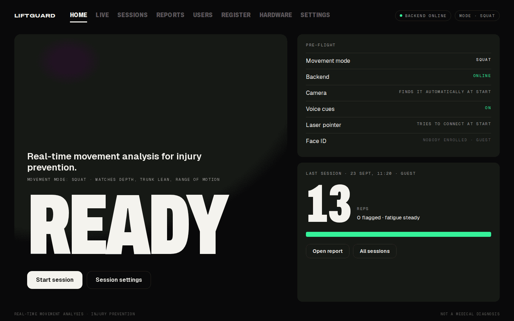
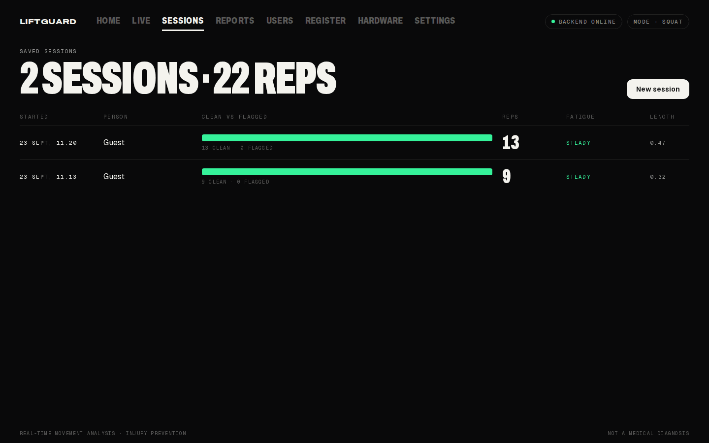
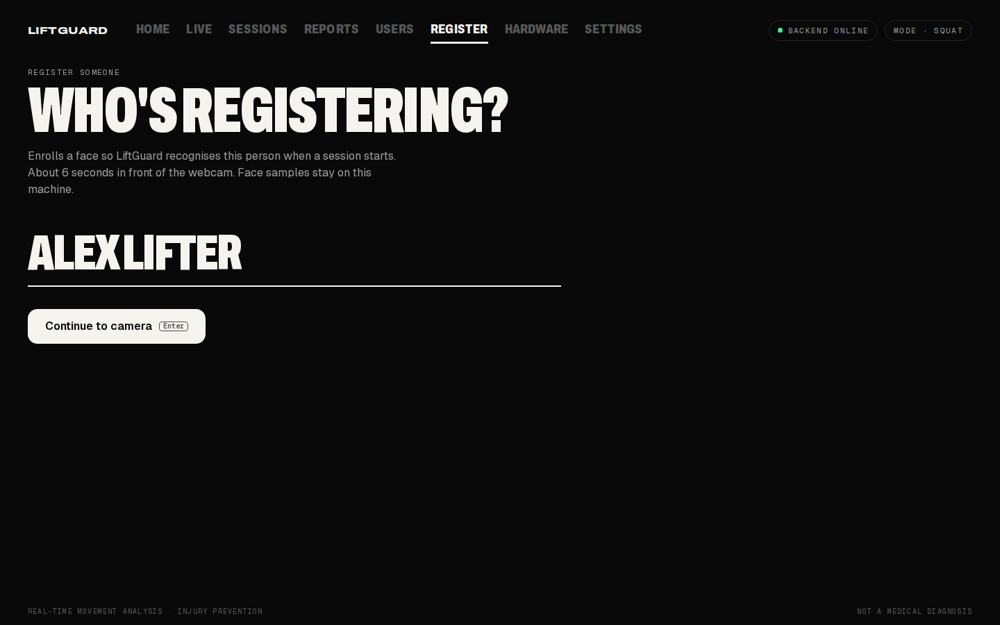
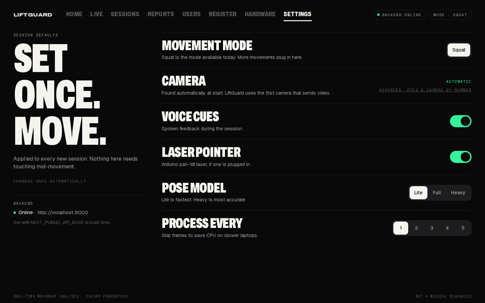

# LiftGuard

**Real-time movement analysis and injury prevention platform. Squat is the first movement mode.**

Point a camera at someone training. LiftGuard tracks the body, counts each rep, and flags the form patterns that coaches correct: shallow depth, too much forward lean, a cut-short range of motion. As the set goes on, it watches how each rep compares with the first ones and shows a fatigue indicator. It runs on one laptop, offline, with a browser dashboard.

> LiftGuard gives coaching feedback, not medical advice. Form-risk flags and the fatigue indicator are measured from 2D video. They don't diagnose anything and aren't an injury probability. Prevention here means catching risky form while the set is still happening, so it can be corrected.

<p align="center">
  
</p>

<table>
  <tr>
    <td width="33%"></td>
    <td width="33%"></td>
    <td width="33%"></td>
  </tr>
  <tr>
    <td align="center"><sub>Every session saved, clean vs flagged at a glance</sub></td>
    <td align="center"><sub>Face-ID registration from the browser camera</sub></td>
    <td align="center"><sub>Set once: camera found automatically</sub></td>
  </tr>
</table>

<sub>The screenshots were taken during development, so their session numbers come from test footage. A live-view capture will be added once there is a recorded side-view session to show.</sub>

## Start it

### Windows (one click)

1. Install [Python 3.11](https://www.python.org/downloads/release/python-3119/) (tick **"Add python.exe to PATH"**) and [Node.js 20 LTS](https://nodejs.org). This is only needed once.
2. Double-click **`START-LIFTGUARD.bat`**.

The first run sets everything up, which takes several minutes while it downloads the ML stack (MediaPipe, OpenCV, PyTorch). After that it starts in seconds. It starts the backend and the dashboard, waits until the backend reports healthy, and opens <http://localhost:3000>. To stop, press Enter in the LiftGuard window or double-click **`STOP-LIFTGUARD.bat`**.

If a step fails, the window says which step and why. It also prints one block between two yellow lines (saved to `.liftguard\diagnostics.txt`) with versions and log lines, ready to copy into an issue or message.

### Linux, macOS and GitHub Codespaces

- Linux / macOS: `./start.sh`, then `./stop.sh` to stop.
- Codespaces: **Code → Codespaces → Create codespace on main**. The dashboard opens once setup finishes. See [docs/CODESPACES.md](docs/CODESPACES.md).

Logs for every platform go to `.liftguard/`.

## What it does today

| | |
|---|---|
| **Rep counting** | Counts squats live from a webcam or a video file. There are no fixed thresholds: each session calibrates to the person's own depth and the camera angle from the last 30 seconds of movement. |
| **Rejecting reps that aren't squats** | A counted rep has to keep the feet planted, lower the hips and bend both knees, so knee lifts, jump dips and bobbing don't count. Rejected attempts are reported with the reason. |
| **Form-risk flags** | Each rep can be flagged `LIMITED_DEPTH` (knee angle stays above 110°), `EXCESSIVE_TRUNK_LEAN` (trunk above 45°) or `LOW_RANGE_OF_MOTION` (under 45° of movement). The rules are simple on purpose, so every flag can be explained. |
| **Fatigue indicator** | A 0-100 score for how far rep time, depth and trunk lean drift from the first reps. It stays blank until there are enough reps to compare. |
| **Voice cues** | Optional spoken corrections through the laptop's speech engine. Cues have cooldowns so it doesn't talk over the lifter. |
| **Face-ID registration** | Register a lifter from the browser's camera in about six seconds. Sessions then start under their name, and anyone else trains as Guest. Uses OpenCV face recognition and stays on the machine. |
| **Camera auto-detect** | Press Start and LiftGuard uses the first camera that actually sends video. Clear messages when the camera is missing, busy in another app or blocked by Windows privacy settings. |
| **Session reports** | Stopping a session saves it. Each report has reps, flags, depth, rep timing and the fatigue trend. |
| **Offline video analysis** | `python backend/analyze_video.py clip.mp4` turns a recorded side-view squat into an annotated MP4, a per-rep CSV and a JSON report. The same input always gives the same result. |

## How it works

```
Camera or video file
      │
      ▼
MediaPipe pose ──► joint angles (knee, hip, trunk) ──► rep state machine
                                                      │  per-session calibration
                                                      │  leg gates (feet, hips, both knees)
                                                      ▼
                                         reps · form-risk flags · fatigue indicator
                                                      │
            FastAPI backend (REST + WebSocket) ◄──────┘
                      │
                      ▼
            Next.js dashboard in any browser
```

The live counter and the offline analyzer share one engine (`backend/app/video_analysis/`), so a clip gives the same reps whether it's streamed or analysed as a file. [docs/REVIVAL_SCOPE.md](docs/REVIVAL_SCOPE.md) explains how the thresholds are chosen, what each gate checks and what was measured on the development clips.

## Limits, stated plainly

- **Squat only.** Other movements aren't recognised yet. The screen says "Detecting squat..." until the first real rep.
- **2D angles.** Joint angles are measured in the image plane, not in 3D. A side view works best. Keep the whole body in frame, in one continuous shot: a camera cut or zoom can fake or hide a rep.
- **Not validated as a medical or biomechanical tool.** The thresholds were checked on development clips and synthetic tests, not in a clinical study.
- **Experimental, off by default:** the pan-tilt laser (Arduino / ESP32) and the older TCN risk model. No trained weights ship for the model, so the dashboard shows none of its output.
- **Face recognition** is OpenCV's LBPH recogniser. Fine for telling apart a few registered lifters on one machine. Not an identity or security check.
- **One camera session at a time** per backend.

## Where it's going

Squat is the first movement mode, not the last. The engine is built so a new mode brings three things: its own joint metrics, a rep definition with gates that reject look-alike movements, and form rules a coach would sign off on. Each one is checked against recorded clips before it ships. The same pipeline, calibration and report format then carry over unchanged.

## Development

```bash
# Backend tests (fast, no camera or ML stack needed)
cd backend && pip install -r requirements-dev.txt && pytest -q && ruff check app tests

# Frontend type-check and production build
cd frontend && npm ci && npx tsc --noEmit && npm run build
```

The backend suite has 67 tests. They cover angle maths, deterministic rep analysis on recorded landmark fixtures (15 squats counted, 0 on jumps and holds), report output, low-visibility failure, headless session start, camera errors and session lifecycle edge cases. CI runs the tests plus both builds on every pull request.

Manual start, if you'd rather not use the launcher:

```bash
cd backend && python3.11 -m venv .venv && . .venv/bin/activate && pip install -r requirements.txt
uvicorn app.main:app --port 8000          # terminal 1
cd frontend && npm ci && npm run dev      # terminal 2, then open http://localhost:3000
```

Useful settings (environment variables):

| Variable | Default | What it does |
|---|---|---|
| `LIFTGUARD_CAMERA_SOURCE` | unset | Analyse a video file or stream URL instead of a webcam |
| `LIFTGUARD_VOICE_ENABLED` | `true` | Spoken cues |
| `LIFTGUARD_API_KEY` | unset | Require a key for every API and WebSocket call |
| `LIFTGUARD_USER_DB` | `backend/data/…` | Where lifters and sessions are stored |

## Repository map

```
backend/    FastAPI app, pose + rep engine (app/video_analysis), sessions, face ID, tests
frontend/   Next.js dashboard (live view, registration, sessions, reports, settings)
firmware/   ESP32 laser firmware (experimental)
docs/       Scope, method and known limits; Codespaces guide
start.sh · START-LIFTGUARD.bat · stop.sh · STOP-LIFTGUARD.bat
```

## Security

The backend can enroll faces, read session data and drive hardware, so it listens on `127.0.0.1` by default and has an opt-in API key. If you set `LIFTGUARD_API_KEY`, set the same value as `NEXT_PUBLIC_LIFTGUARD_API_KEY` for the dashboard. Only run the dashboard as a trusted operator UI, because `NEXT_PUBLIC_*` values end up in browser code. ESP32 connections only go to private-network hosts or an explicit allowlist. See [SECURITY.md](SECURITY.md).

## License

See [LICENSE](LICENSE).
